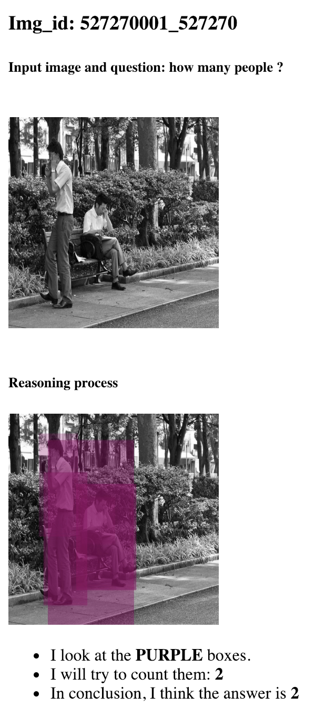
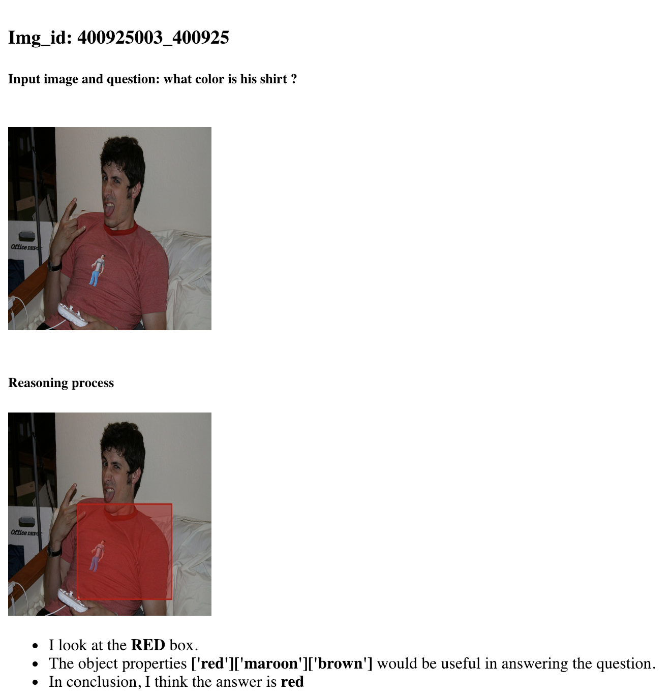
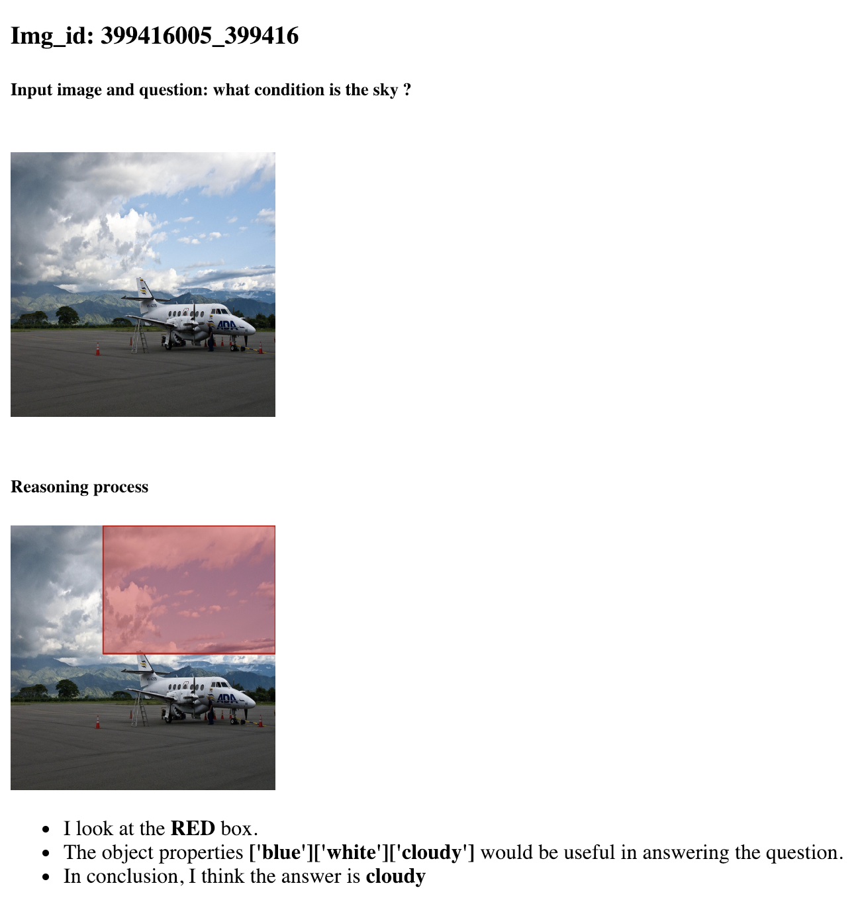
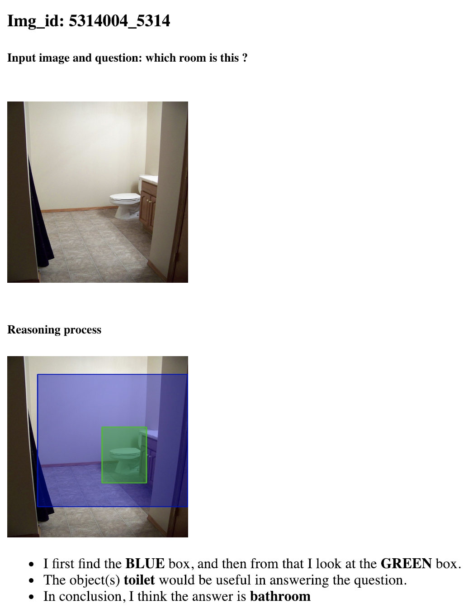
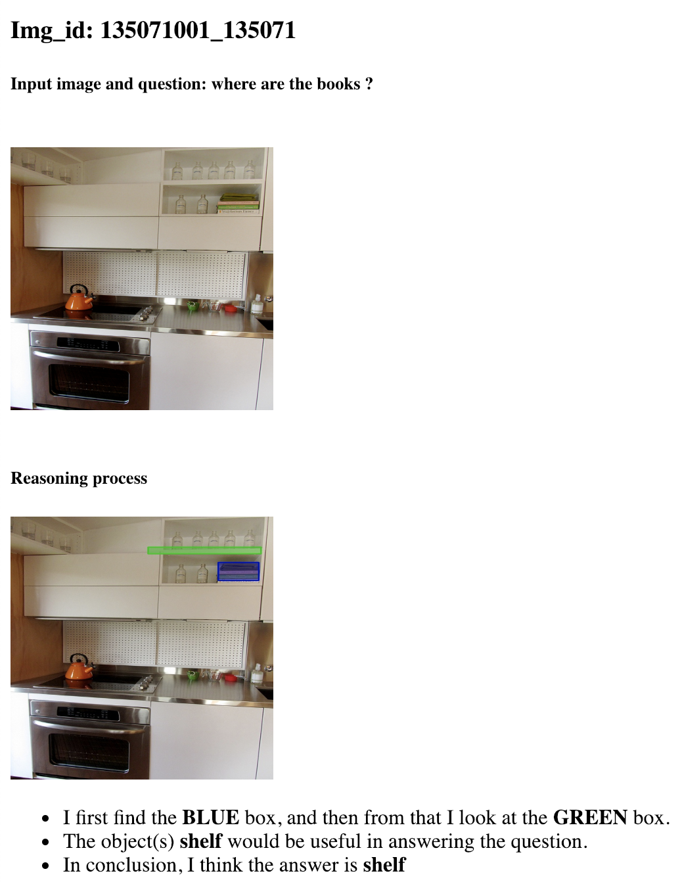
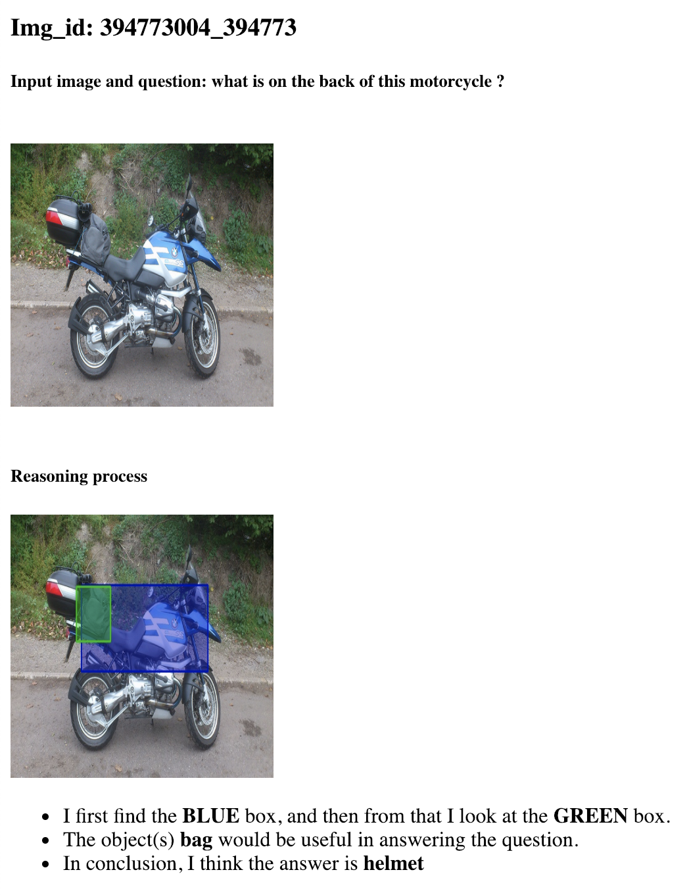
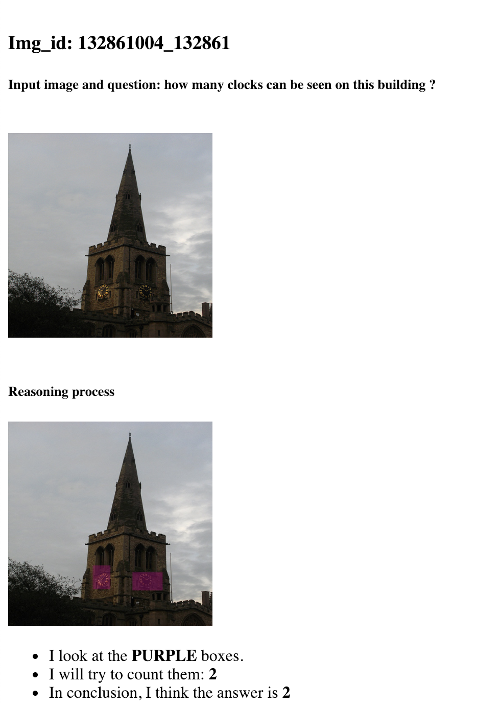

# pmn_demo
This repository contains code for running trained model from Visual Reasoning by Progressive Module Networks (ICLR19)

Paper: https://arxiv.org/abs/1806.02453 (Arxiv)

Dependencies:
pytorch 0.3, python 2.7

To run the code:
1. Download trained model (model_ckpt.t7) from https://drive.google.com/open?id=1xwPEuft-X-Uw1B9ZWFeNvpiwDvlKzBeb
2. Run python run_demo.py
3. Run python generate_html.py full-path-to-saved-outputs(default: ./test)
4. Find result.html in full-path-to-saved-outputs(default: ./test)

Example output:

(Optionally):
To run on your own data, you need to extract bounding boxes using the model from https://github.com/peteanderson80/bottom-up-attention
